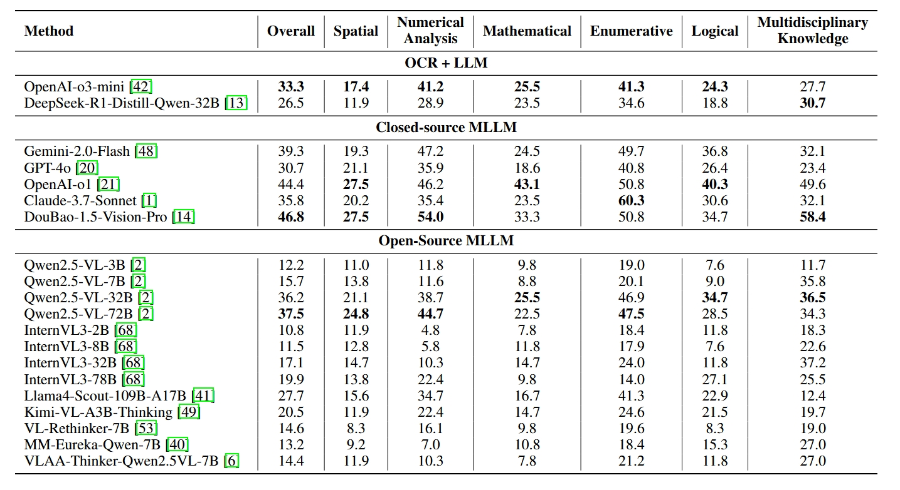

<p align="center">

  <h2 align="center"><strong>OCR-Reasoning Benchmark: Unveiling the True Capabilities of MLLMs in Complex Text-Rich Image Reasoning</strong></h2>

<div align="center">
<h5>
<em>Mingxin Huang<sup>1</sup>, Yongxin Shi<sup>1</sup>, Dezhi Peng<sup>2*</sup>, Songxuan Lai<sup>2</sup>, Zecheng Xie<sup>2</sup>, Lianwen Jin<sup>1*</sup></em>
<br><sup>1</sup> South China University of Technology   &emsp; <sup>2</sup> Huawei Cloud</br>
</h5>
</div>

<h5 align="center">
<a href="https://arxiv.org/pdf/2505.17163"> </a><a href="https://huggingface.co/datasets/mx262/OCR-Reasoning"></a>
</h5>


# 👋 Introduction

Recent advancements in multimodal slow-thinking systems have demonstrated remarkable performance across diverse visual reasoning tasks. However, their capabilities in text-rich image reasoning tasks remain understudied due to the lack of a systematic benchmark. To address this gap, we propose OCR-Reasoning, a comprehensive benchmark designed to systematically assess Multimodal Large Language Models on text-rich image reasoning tasks. The benchmark comprises 1,069 human-annotated examples spanning 6 core reasoning abilities and 18 practical reasoning tasks in text-rich visual scenarios. Furthermore, unlike other text-rich image understanding benchmarks that only annotate the final answers, OCR-Reasoning also annotates the reasoning process simultaneously. With the annotated reasoning process and the final answers, OCR-Reasoning evaluates not only the final answers generated by models but also their reasoning processes, enabling a holistic analysis of their problem-solving abilities. Leveraging this benchmark, we conducted a comprehensive evaluation of state-of-the-art MLLMs. Our results demonstrate the limitations of existing methodologies. Notably, even state-of-the-art MLLMs exhibit substantial difficulties, with none achieving accuracy surpassing 50\% across OCR-Reasoning, indicating that the challenges of text-rich image reasoning are an urgent issue to be addressed.


# 🔥 News

- **[`05/24/2025`]**: The evaluation of OCR-Reasoning is now supported in [VLMEvalKit](https://github.com/open-compass/VLMEvalKit). 

- **[`05/18/2025`]**: Release the [dataset](https://huggingface.co/datasets/mx262/OCR-Reasoning) and evaluation script.


# 📌 Highlights


- **We concretely define various core sub-abilities for text-rich image reasoning.** OCR-Reasoning comprises a meticulously collected 1,069 human-annotated examples spanning 6 core reasoning abilities: spatial Reasoning, numerical analysis reasoning, mathematical reasoning, enumerative reasoning, logical reasoning, and multidisciplinary knowledge reasoning.

- **The visual information in images is crucial for the OCR Reasoning task.** when we replace images with OCR results and feed them into LLMs, we observe that their accuracy is relatively low. This indicates that text alone is insufficient for solving text-rich image reasoning tasks.

- **Existing models still have room for improvement in OCR reasoning tasks.** Even state-of-the-art MLLMs exhibit substantial difficulties, with none achieving accuracy surpassing 50\% across OCR-Reasoning.

- **Existing reinforcement learning methods perform poorly on text-rich image reasoning tasks.** Designing reinforcement learning for text-rich image reasoning is a potential direction for enhancing text-rich image reasoning capabilities.


# 🔨 Evaluation

We have integrated OCR-Reasoning into the VLMEvalKit framework. For the environment configuration and the use of API, please refer to [VLMEvalKit](https://github.com/open-compass/VLMEvalKit). Clone this repo and run the evaluate script. The code will automatically download images and annotations from HuggingFace.

```bash
git clone https://github.com/SCUT-DLVCLab/OCR-Reasoning
cd OCR_Reasoning
python run.py --data OCR_Reasoning --model Qwen2.5-VL-7B-Instruct --verbose
```

# 📖 Main Results


# 🐳 Dataset Examples


# 📜 License
OCR-Reasoning is licensed under [CC BY-NC-SA 4.0](https://creativecommons.org/licenses/by-nc-sa/4.0/).


# 💗 Acknowledgement
Some image are collected from [InfoVQA](https://openaccess.thecvf.com/content/WACV2022/papers/Mathew_InfographicVQA_WACV_2022_paper.pdf), [DocVQA](http://openaccess.thecvf.com/content/WACV2021/papers/Mathew_DocVQA_A_Dataset_for_VQA_on_Document_Images_WACV_2021_paper.pdf), [CharXiv](https://proceedings.neurips.cc/paper_files/paper/2024/file/cdf6f8e9fd9aeaf79b6024caec24f15b-Paper-Datasets_and_Benchmarks_Track.pdf), [WildReceipt](https://arxiv.org/pdf/2103.14470), and [MME-Finance](https://arxiv.org/pdf/2411.03314?).


## ✒️Citation

If you find OCR-Reasoning helpful, please consider giving this repo a :star: and citing:

```latex

```

Thanks for your support!
